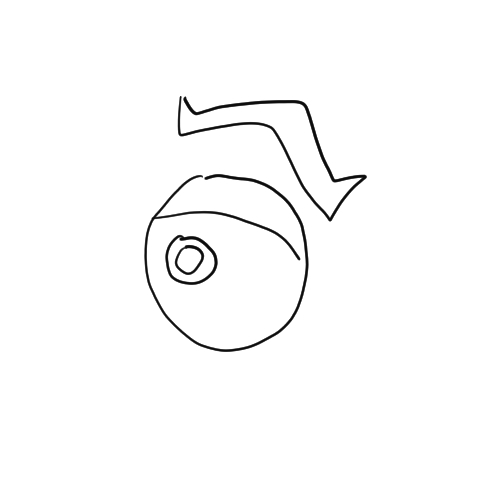
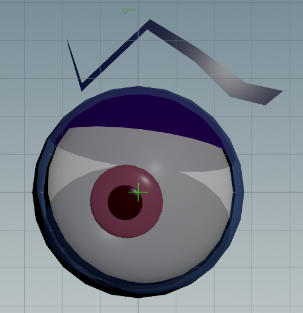
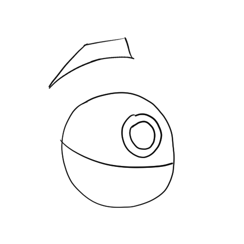
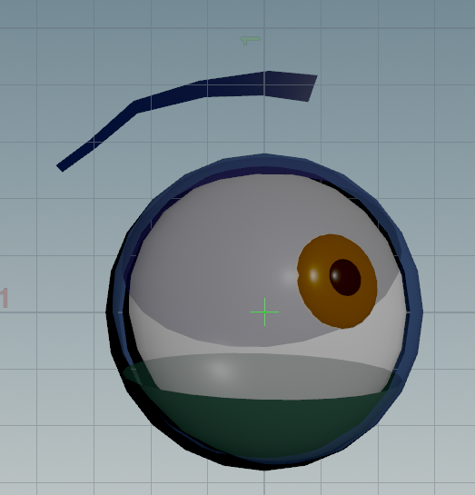
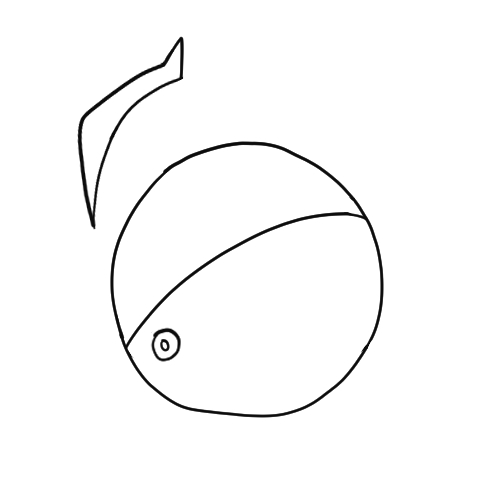
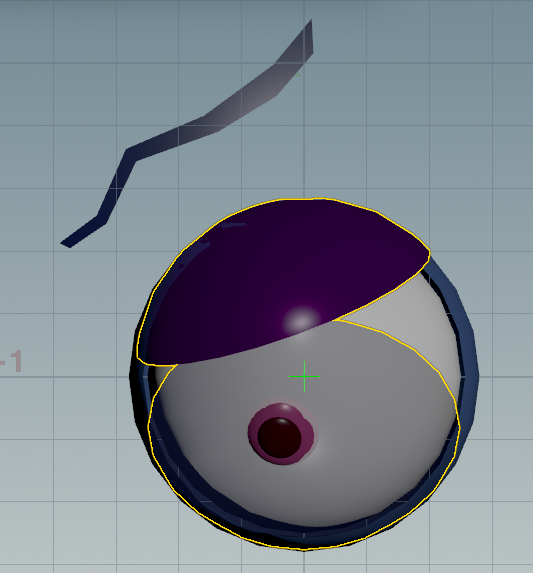

# 🎨 Sketch2Rig: Automating Houdini Facial Controls from 2D Expressions using Machine Learning

This project uses a PyTorch-based supervised learning model to **automatically infer facial rig slider values in Houdini** based on hand-drawn 2D expressions.

---

## 🔍 Overview

Sketch2Rig is a pipeline that takes 2D sketch drawings of eyes and eyebrows and maps them to a 3D facial rig pose in Houdini. It uses a convolutional neural network (CNN) to regress 18 facial expression sliders based on grayscale input sketches.

---

## 🧠 Machine Learning Model (Version 03)

### Training

- `expression_train_06.02.02.py`: Trains a CNN regression model on custom sketch data using MSE loss.
- Images are located in the `images/` directory.
- Ground truth slider values are in `train_labels_02.csv` and `val_labels_02.csv`.

### Inference

- `expression_infer_06.02.02.py`: Runs inference on grayscale test sketches in the `inference/` folder.
- Outputs predicted slider values to the console, logs them in `inferred_results.csv`, and tracks total inference time.

---

## 📎 Houdini Integration

- Open the Houdini file:\
  `3DModel/eyeballbrow_v04.0.hipnc`

- Copy and paste the script from:\
  `expresssion_insert_to_houdini_pythonshell_02.py`\
  into Houdini’s **Python Shell**

- The script reads `inferred_results.csv` and automatically updates the facial rig’s `Eye_UI` controller node with the predicted slider values.

---

## 🗂 Folder Structure

```
📁 3DModel/                         # Houdini scene file with rig
📁 Documentation/                  # Gifs and images for documentation
│   ├── GIFs/
│   └── Photos/
📁 images/                         # Training images (used by training script)
📁 inference/                      # Test sketches for inference
📄 labels_02.csv                   # CSV of 18 slider values for each training image
📄 inferred_results.csv            # Predicted outputs from inference script
📄 expression_train_06.02.02.py    # Training script
📄 expression_infer_06.02.02.py    # Inference script
📄 expresssion_insert_to_houdini_pythonshell_02.py  # Houdini integration script
📄 README.md
```

## 🖼️ Visuals

### ✅ Inference Demo


---

## Example Sketch to Rig Output

This table shows the sketch input on the left and the generated 3D rig output on the right using our trained model.

| Sketch Input | Houdini Output |
|--------------|----------------|
| <div align="center"><br/>Angry Sketch</div> | <div align="center"><br/>Angry Rig</div> |
| <div align="center"><br/>Happy Sketch</div> | <div align="center"><br/>Happy Rig</div> |
| <div align="center"><br/>Sad Sketch</div> | <div align="center"><br/>Sad Rig</div> |

---
## 🚀 Getting Started

1. **Prepare a test sketch**

   - Use an existing sketch in the `inference/` folder, or draw a new grayscale eye + eyebrow sketch (128×128).
   - This will be used to drive the 3D facial rig expression.

2. **Train the model**\
   Train the model with the given dataset:

   ```bash
   python expression_train_06.02.02.py
   ```

   - Uses images from `images/` and labels from `train_labels_02.csv`, `val_labels_02.csv`.

3. **Run inference on sketch**\
   Predict slider values for your test sketch:

   ```bash
   python expression_infer_06.02.02.py
   ```

4. **Open Houdini and the rig scene**

   - Open this file in Houdini:\
     `3DModel/eyeballbrow_v04.0.hipnc`

5. **Insert values into Houdini's Python Shell**

   - Open the Houdini Python Shell.
   - Copy-paste the contents of `expresssion_insert_to_houdini_pythonshell_02.py`.
   - The script will read from `inferred_results.csv` and update the `Eye_UI` slider controls.

---

