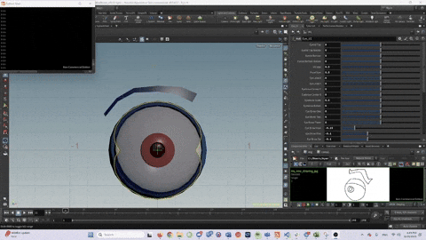
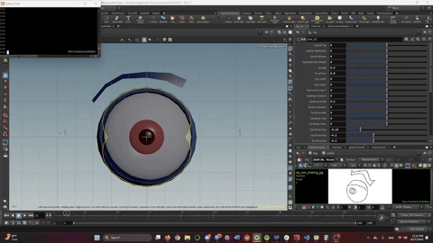

# 🎨 Sketch2Rig: Automating Houdini Facial Controls from 2D Expressions using Machine Learning

This project uses a PyTorch-based supervised learning model to **automatically infer facial rig slider values in Houdini** based on hand-drawn 2D expressions.

---

## 🔍 Overview

Sketch2Rig is a pipeline that takes 2D sketch drawings of eyes and eyebrows and maps them to a 3D facial rig pose in Houdini. It uses a convolutional neural network (CNN) to regress 18 facial expression sliders based on grayscale input sketches.

---

## 🧠 Machine Learning Model

### Training
- `expression_train_02.py`: Trains a CNN regression model on custom sketch data.
- Images are stored in the `images/` folder.
- Slider values are labeled in `labels_01.csv`.

### Inference
- `expression_infer_02.py`: Loads the trained model and performs inference on grayscale test sketches located in the `inference/` folder.
- Outputs the predicted slider values to the console and saves them in `inferred_results.csv`.

---

## 📎 Houdini Integration

- Open the Houdini file:  
  `3DModel/eyeballbrow_v02.0.hipnc`

- Copy and paste the script from:  
  `expresssion_insert_to_houdini_pythonshell_01.py`  
  into Houdini’s **Python Shell**

- The script reads `inferred_results.csv` and automatically updates the facial rig’s `Eye_UI` controller node with the predicted slider values.

---

## 🗂 Folder Structure

```
📁 3DModel/                         # Houdini scene file with rig
📁 Documentation/                  # Gifs and images for documentation
📁 images/                         # Training images (used by training script)
📁 inference/                      # Test sketches for inference
📄 labels_01.csv                   # CSV of 18 slider values for each training image
📄 inferred_results.csv            # Predicted outputs from inference script
📄 expression_train_02.py          # Training script
📄 expression_infer_02.py          # Inference script
📄 expresssion_insert_to_houdini_pythonshell_01.py  # Houdini integration script
📄 README.md
```

---

## 🖼️ Visuals

### ✅ Inference Demo (06-20-2025)


### ✅ Inference Demo (Latest - 06-27-2025)


---

## 🚀 Getting Started

1. **Prepare a test sketch**  
   - Use an existing sketch in the `inference/` folder, or draw a new grayscale eye + eyebrow sketch (128×128).
   - This will be used to drive the 3D facial rig expression.

2. **Train the model**  
   Train the model with given dataset:
   ```bash
   python expression_train_02.py
   ```
   - Uses images from `images/` and labels from `labels_01.csv`.

3. **Run inference on sketch**  
   Predict slider values for your test sketch:
   ```bash
   python expression_infer_02.py
   ```

4. **Open Houdini and the rig scene**  
   - Open this file in Houdini:  
     `3DModel/eyeballbrow_v02.0.hipnc`

5. **Insert values into Houdini's Python Shell**  
   - Open the Houdini Python Shell.
   - Copy-paste the contents of `expresssion_insert_to_houdini_pythonshell_01.py`.
   - The script will read from `inferred_results.csv` and update the `Eye_UI` slider controls.

---
